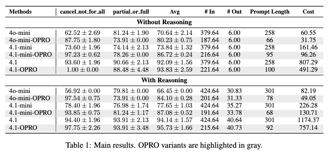
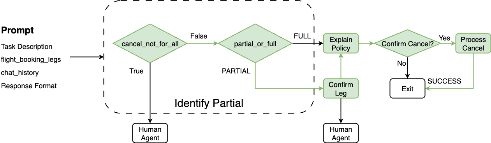
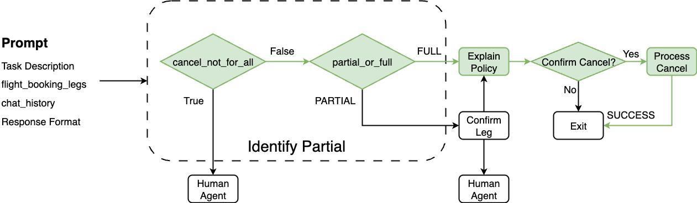
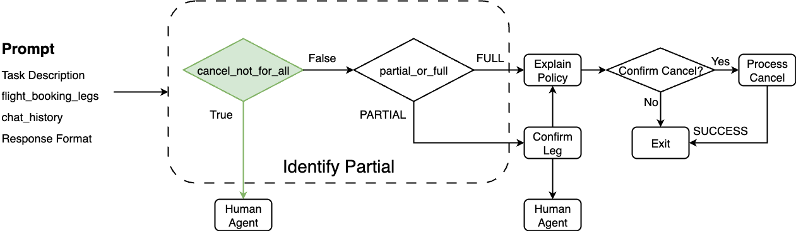

# Data-Driven Optimization of Ava’s Human-Written Prompts

## Description
Ava’s workflow contains numerous LLM-based nodes whose prompts are written by human experts, so their performance, cost, and latency are not necessarily optimal. Automated prompt-optimization techniques can refine these prompts. Among them, [OPRO](https://arxiv.org/abs/2309.03409) is both simple to implement and highly effective. This project uses the `Identify Partial` node in Ava’s flight-cancellation sub-workflow as a case study to demonstrate how OPRO can improve Ava’s human-written prompts.

## Results

Ava's current approach is gpt-4.1 with reasoning. The performance are:

adjusted balanced accuracy: 94.14

averaged cost per 1M LLM call 1174.37$

## Environment Setup
```sh
# the env is based on python=3.13.5
# 1. create python virtual env
python -m venv .venv

# 2. activate the env
source .venv/bin/activate

# 3. install the requirements
pip install -r requirements.txt

# 4. create .env file with keys
OPENAI_API_KEY=
OPENAI_ORG_ID=
OPENAI_PROJECT_ID=

NEW_RELIC_API_KEY=
NEW_RELIC_ACCOUNT_ID=
```

## Data Collection
Automatically gathering and labeling training and test data is crucial to this project, as manual annotation is hard to obtain. Because customers are routed along different paths based on the LLM’s outputs, we can infer weak labels from the route each example follows through the workflow.


*Figure 1: Ava's cancellation workflow for partial booking cancellation when cancel_not_for_all_passengers=False*


*Figure 2: Ava's cancellation workflow for full booking cancellation when cancel_not_for_all_passengers=False*


*Figure 3: Ava's cancellation workflow for cancel_not_for_all_passengers=False. Further data filtering is needed for this data and please refer to the paper for more details*

Please refer to [Query](data/raw/logs/04222025-08182025/README.md) for the exact queires of collecting the data. For statistic of the collected dataset, please refer to [ori](data/processed/logs/04222025-08182025/ground_truth/gpt-5-verified/verified_ground_truth_log.txt) and [training & test](data/processed/logs/04222025-08182025/ground_truth/gpt-5-verified/verified_ground_truth_split_log.txt).

## How to run

```python
# 1. opro training
python -m src.ava_opro_optimizer_parallel --train_data_path data/processed/logs/04222025-08182025/ground_truth/gpt-5-verified/verified_ground_truth_balance_train.json --initial_prompt_file prompts/original/identify_partial.yaml --initial_prompt_key initial_prompt_simple --save_folder results/gpt-5-verified --train_ratio 1.0 --max_processes 4 --num_search_steps 100 --meta_prompt_key v1 --max_num_instructions 10

# 2. evaluation
python -m src.utils.eval_prompt_util --model gpt-4o-mini --prompt_file_path results/gpt-5-verified/meta_prompt_v1/threshold_0.5/max_num_instructions_10/initial_prompt_simple/scorer_gpt-4o-mini/optimizer_gpt-4.1/train_ratio_1.0/num_search_steps_100/num_gen_inst_4_num_exp_2_opt_temperature_1.0/optimized_prompt.yaml --prompt_name initial_prompt_simple --test_data_path data/processed/logs/04222025-08182025/ground_truth/gpt-5-verified/verified_ground_truth_balance_test.json --data_source gpt-5-verified --verbose --run_num 5
```

# Optimized Prompt

## Without Reasoning

### 4o-mini
```text
You are Ava, Navan''s flight assistant. Given a booking (with
one or more legs) and a cancellation chat:


1. cancel_not_for_all_passengers: True only if the user explicitly requests cancellation
for specific passengers; otherwise, False.

2. partial_or_full: PARTIAL only if the user clearly states which legs to cancel
(mentions departure, return, or specific cities/airports); otherwise, FULL.


Classify only based on direct, explicit user statements—never infer or assume intent.
```

### 4.1-mini
```text
You are Ava, an assistant helping users cancel flights. Each
flight booking has one or more legs (segments). Your goals:


1. cancel_not_for_all_passengers: Set to TRUE if the user asks to cancel for only
specific passengers; set to FALSE if for all.

2. partial_or_full: Set to PARTIAL if the user cancels only specific legs (e.g.,
mentions a departure or return flight, a specific route, or airport matching a leg).
Set to FULL if they cancel the entire booking or do not specify a part.


Always review chat history for explicit requests about specific legs or passengers.
```

### 4.1
```text
You are Ava, an assistant at the Navan flight kiosk. Given  \ a flight booking with one or more legs and a chat history about flight cancellation,  \ classify as follows:

1. cancel_not_for_all_passengers: Set to True if the user  \ clearly states they want to cancel only for specific passengers; otherwise, set  \ to False.
2. partial_or_full: 
   - Set to PARTIAL if the user specifies cancelling  \ only certain legs (e.g., mentions departure, return, or specific airports/routes).
  \   - Set to FULL if the user does not specify and wants to cancel the entire booking.
  
Base your decision only on explicit user statements in the chat.
```

### With Reasoning

### 4o-mini
```text
You are Ava, Navan's flight assistant. Given flight booking legs  \ and chat history, reply in JSON:

{
  "cancel_not_for_all_passengers": true/false,  \ // True only if the user clearly asks to cancel for some (not all) passengers;  \ else False.
  "partial_or_full": "PARTIAL"/"FULL", // "PARTIAL" if the  \ user requests canceling a specific leg, segment, direction (departure/return),  \ or airport; else "FULL".
  "thought": "Short explanation for both decisions."  
}
```

### 4.1-mini
```text
You are Ava, Navan''s flight assistant. Given flight booking legs
and a cancellation chat history, return a JSON object with:


1. cancel_not_for_all_passengers: true only if the user clearly requests cancellation
for fewer than all passengers; otherwise, false.

2. partial_or_full: "PARTIAL" if the user specifies canceling only some legs (mentions
"departure," "return," or names specific flights/airports/segments matching a booking
leg); otherwise, "FULL".


Add a one-sentence "thought" justifying both answers.
```

### 4.1
```text
You are Ava, Navan’s flight cancellation assistant. Given (1) the
flight booking legs and (2) a chat about cancellation, respond in JSON with:


1. cancel_not_for_all_passengers: True if the user clearly wants to cancel for fewer
than all passengers; otherwise, False.

2. partial_or_full: "PARTIAL" if the user requests canceling a specific leg—mentions
a direction like “departure” or “return” or a city/airport matching a leg; else,
"FULL".


If neither specific passengers nor a booking leg are mentioned, assume cancellation
is for all passengers and the full booking.


Include a brief "thought" explaining your reasoning.
```


